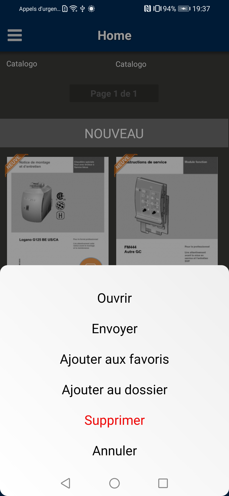

# Titanium Android BottomSheet module

Use the native Android `BottomSheet` view in Appcelerator Titanium. 

Credits go to the native [`michael-rapp/AndroidBottomSheet`](https://github.com/michael-rapp/AndroidBottomSheet) library 
and [@chrystoffer](https://github.com/chrystoffer) for the initial Hyperloop based example. Thanks guys! 🤘



## Requirements
- [x] Titanium SDK 8.3.0+

## Download
- [x] [Stable release](https://github.com/hansemannn/titanium-android-bottom-sheet/releases)

## API's

### `createOptionDialog`

#### Arguments

| Name | Type |
| - | - |
| `title` | String |
| `colors` | Array<String> |
| `options` | Array<String> |
| `cancelable` | Boolean |
| `destructive`* | Number |

> `*` The `destructive` option is there to mimic the native iOS behavior by tinting the title
red. Different to iOS, the title will be red if the index is > -1 and is not applied to a single
option but the title.

#### Events

##### `click`

| Name | Type |
| - | - |
| `index` | Number |
| `cancel` | Boolean |

## Examples

```js
import TiBottomSheet from 'ti.bottomsheet';

const options = TiBottomSheet.createOptionDialog({
  title: 'Titanium rocks!',
  colors: [ 'black', 'red' ],
  options: [ 'Option A', 'Option B' ],
  cancelable: true
});

options.addEventListener('click', event => {
  alert(event);
});

options.show();
```


## Theme example from screenshot

Put this in your /platform/android/res/values/theme.xml

<style name="Theme.BottomSheet" parent="Theme.AppCompat.Light.Dialog.Alert">
    <item name="android:windowBackground">@android:color/transparent</item>
    <item name="colorPrimaryDark">@color/primary_dark</item>
     <item name="windowNoTitle">true</item>
     <item name="windowActionBar">false</item>
     <item name="android:windowIsFloating">false</item>
     <item name="android:windowTranslucentStatus">true</item>
     <item name="android:windowTranslucentNavigation">true</item>
     <item name="android:statusBarColor">@color/primary_child</item>
    <item name="android:windowFullscreen">false</item>
    <item name="android:fitsSystemWindows">true</item>
    <item name="android:gravity">center_horizontal</item>
    <item name="android:layout_centerInParent">true</item>
    <item name="android:windowContentOverlay">@null</item>
    <item name="android:backgroundDimEnabled">true</item>
    <item name="bottomSheetDragSensitivity">25%</item>
    <item name="bottomSheetDividerColor">@color/divider_dark</item>
    <item name="bottomSheetDimAmount">40%</item>
    <item name="android:windowAnimationStyle">@style/BottomSheetAnimation</item>
</style>


## Build
```js
cd android
ti build -p android --build-only
```

## Legal

Copyright (c) 2019-present by Hans Knöchel. All Rights Reserved.
Modfied Version by Marc Benderr 2021
